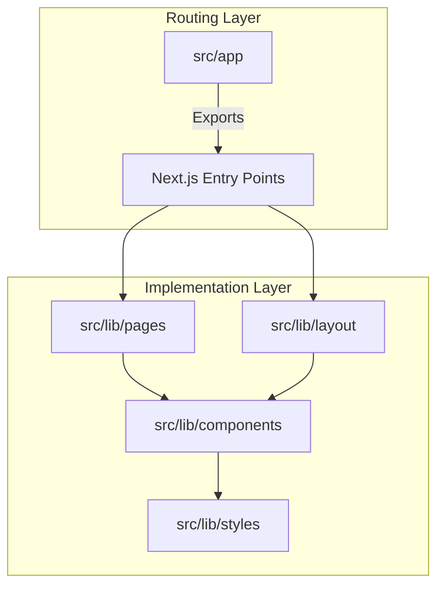

# nextarter-tailwind

A highly opinionated, bleeding-edge Next.js template focused on developer experience, strict code quality, and performance.

[](https://vercel.com/import/git?s=https://github.com/agustinusnathaniel/nextarter-tailwind) [](https://app.netlify.com/start/deploy?repository=https://github.com/agustinusnathaniel/nextarter-tailwind)
[](https://stackblitz.com/github/agustinusnathaniel/nextarter-tailwind)

---

## 🔋 Features

- 🚀 **Next.js & React**: Uses Next.js App Router and React 19.
- 🎨 **Tailwind CSS v4**: CSS-first styling with the latest engine.
- 🛠️ **Biome**: Single tool for linting and formatting (35x faster than Prettier/ESLint).
- 🏎️ **Turborepo**: Optimized build piping and caching.
- 📦 **pnpm**: Fast, disk-space-efficient package management.
- 🔍 **SEO Optimized**: Pre-configured `next-sitemap` and metadata handling.
- 🏗️ **Architectural Integrity**: Separates routing (`app/`) from implementation (`lib/`).
- 🤖 **Agent-Friendly**: Includes `AGENTS.md` to help AI coding assistants reason about the codebase.

---

## 🏗️ Architecture Overview

The project uses a **Lib-Delegation** pattern to keep the routing layer clean.



For more details, see [SPEC.md](./SPEC.md).

---

## 🚀 Getting Started

### 1. Initialize
```bash
npx degit agustinusnathaniel/nextarter-tailwind <APP_NAME>
cd <APP_NAME>
```

### 2. Install Dependencies
```bash
pnpm install
```

### 3. Run Development Server
```bash
pnpm dev
```

Open [http://localhost:3000](http://localhost:3000) to see your app.

---

## 🛠️ Development Workflows

| Task | Command |
| :--- | :--- |
| Lint & Format | `pnpm biome:fix` |
| Type Check | `pnpm type:check` |
| E2E Tests | `pnpm test:e2e` |
| Build | `pnpm build` |
| Release | `pnpm release` |

Detailed contribution guidelines can be found in [CONTRIBUTING.md](./CONTRIBUTING.md).

---

## 📖 Documentation Index

- [**SPEC.md**](./SPEC.md): Technical specification and invariants.
- [**CONTRIBUTING.md**](./CONTRIBUTING.md): Contribution workflow and standards.
- [**AGENTS.md**](./AGENTS.md): Guidance for AI IDEs and coding assistants.

---

## 📝 License

Distributed under the MIT License. See `LICENSE` for more information.

---

Built with ❤️ by [@agstnsnathaniel](https://twitter.com/agstnsnathaniel)
