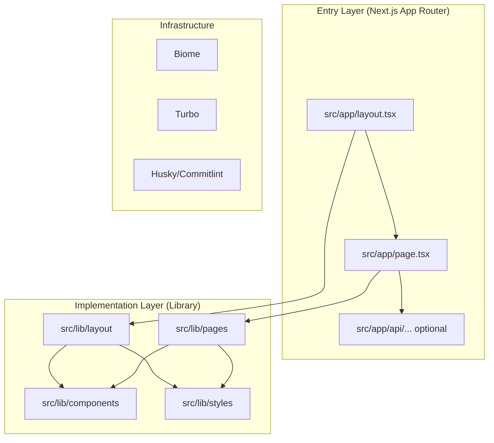
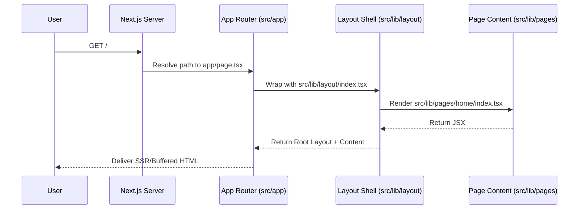

# System Specification: nextarter-tailwind

This document provides a technical specification of the `nextarter-tailwind` template. It outlines the architectural decisions, core concepts, and invariants that govern the repository.

---

## 1. Problem Statement

Modern web development requires a balance between rapid prototyping and maintainable architecture. `nextarter-tailwind` solves the "cold start" problem for Next.js projects by providing a pre-configured environment with:
- Strict linting and formatting (Biome).
- Scalable component architecture (Lib-delegation).
- Performance-first tooling (Turbo).
- Type-safe development (TypeScript).

### Non-Goals
- This is NOT a component library (though it encourages adding one like shadcn/ui).
- This is NOT a state management framework.
- This is NOT a backend starter.

---

## 2. System Architecture

The project follows a **Modified App Router Architecture**. While it uses Next.js App Router for routing and server-side features, the actual UI implementation is decoupled into a `src/lib` directory.

### High-Level Architecture

### Core Modules
| Module | Responsibility |
| :--- | :--- |
| `src/app` | Routing, Metadata, Viewport, and entry-point exports. |
| `src/lib/pages` | Page-specific UI logic and internal components. |
| `src/lib/layout` | Global UI shell, including Header, Footer, and Providers. |
| `src/lib/components` | Shared, reusable UI components (e.g., ThemeToggle). |
| `src/lib/styles` | Global CSS via Tailwind v4, font configurations, and utility functions. |

---

## 3. Data & Lifecycle Flow

### Rendering Lifecycle

---

## 4. Core Concepts & Invariants

### Lib-Delegation Pattern
To keep the `app` directory lean and focused on routing:
- **Rule**: `src/app/page.tsx` SHOULD ONLY import and export a component from `src/lib/pages`.
- **Rule**: Global providers and layout wrappers MUST reside in `src/lib/layout`.

### Styling & Theme
- **Tailwind CSS v4**: Uses the latest JIT engine.
- **Theme Management**: Powered by `next-themes` with a `ThemeProvider` in the root layout.
- **FOUC Prevention**: `suppressHydrationWarning` on `<html>` and server-side theme detection.

### Linting & Formatting
- **Standard**: Biome is used for ALL linting and formatting, replacing ESLint and Prettier.
- **Convention**: Filenames must follow `kebab-case`.

---

## 5. Known Constraints & Trade-offs

1. **Strict Versioning**: Uses highly specific (and sometimes experimental) versions of Node.js and Next.js as defined in `package.json`.
2. **File Size**: Initial bundle is extremely small but grows with `lib` implementation.
3. **No Default Exports**: Biome enforces `noDefaultExport` by default, except for specific entry points where Next.js requires them.
